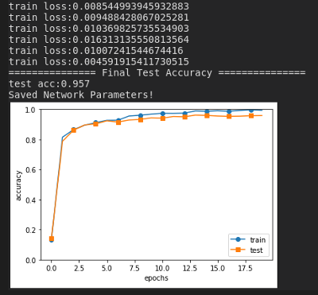

# Deep Learning From Scratch 
### O'Reilly, Chinese version
[](https://www.ituring.com.cn/book/1921)
[](https://www.oreilly.co.jp/books/9784873117584/)
[](https://github.com/oreilly-japan/deep-learning-from-scratch)

## Simple Convolutional Neural Network Training Result (MNIST handwritten dataset)


## Update logs
#### 2019/06/16
Initial repository.

#### 2020/08/15
Start study

#### 2020/08/19
To download MNIST handwrittten digits database, go to folder `ch03`, run

    ```$ python mnist_show.py```

It will take couple of minutes to download and process data.
